# Comparing the CPU/Memory utilisation of a REST and REST + CRUD applications (Quarkus, Payara Micro, Spring Boot, Python)

Some scripts to measure the CPU and Memory utilisation of REST and REST + CRUD applications.
The performance test runs inside a Docker container.

The test uses the following demo projects:

* **demo-payara** contains a simple REST application packaged as uber-jar with **Payara Micro (5.2021.2)** application server
* **demo-payara-jpa** contains an advanced REST + CRUD: JSON-B, CDI, JPA, PostgresDB application packaged as uber-jar with **Payara Micro (5.2021.2)** application server
* **demo-quarkus** contains a simple **Quarkus (1.13.3.Final)** application packaged as jar and additionally compiled as native image using the GraalVM Native Image
* **demo-quarkus-jpa** contains an advanced REST + CRUD: JSON-B, CDI, JPA, PostgresDB **Quarkus (1.13.3.Final)** application packaged as jar and additionally compiled as native image using the GraalVM Native Image
* **demo-python** contains a simple (REST service) and advanced (REST + CRUD) Python application
* **demo-spring-boot** contains a simple REST service using **Spring Boot (2.4.0-M3)**
* **demo-spring-boot-jpa** contains an advanced REST + CRUD: JSON, JPA, PostgresDB service using **Spring Boot (2.4.0-M3)**

## **(1) Prepare and start plot-tests**

1) Modify the **Dockerfile** (look for PROXY) to use a proxy server or not
2) Build the Docker image with ```env_build.sh``` or ```env_build.cmd```
3) Run the image in a new Docker container with ```env_run.sh``` or ```env_run.cmd```
4) Build the demo projects inside the Docker container with ```./scripts/build.sh```
5) Run the tests inside the Docker container with ```./scripts/test-all.sh```
6) Plots are generated to directory ```plots```
7) Logs are generated to directory ```logs```

## **(2) Test scenario**

The **plot-test** consists of the following actions:

* starting the application (simple REST application)
* wait until the first http request to the REST endpoint can be served (time to first request)
* sleep 1 second
* start load-test using apache benchmarking tool
  * requests: 5000
  * concurrency: 5
  * url: the REST endpoint of the application

## **(3) Plots**

All plots are generated on my Notebook inside the running Docker container.

Docker Host Machine:

* CPU: Intel(R) Core(TM) i7-8750H 2.20GHz
* RAM: 32GB

### **(3.1) Quarkus via GraalVM Native Image**

| REST Only                               | REST + CRUD                               |
| ------------------------------------ | -------------------------------------- |
| 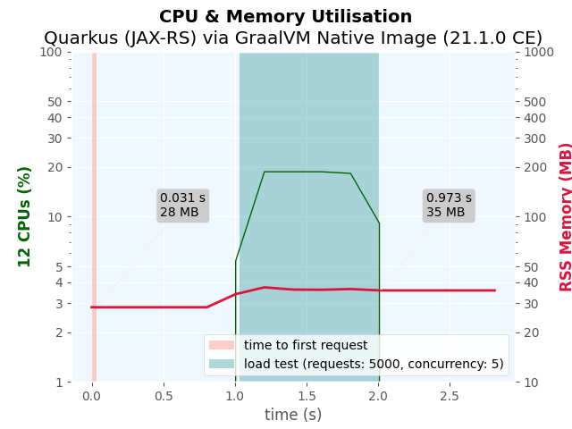 | 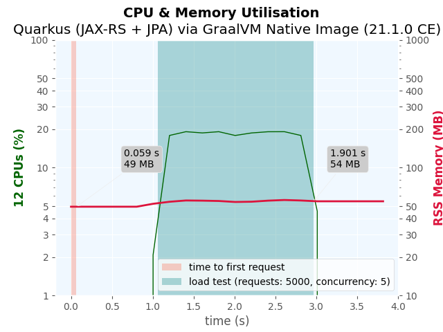 |
| 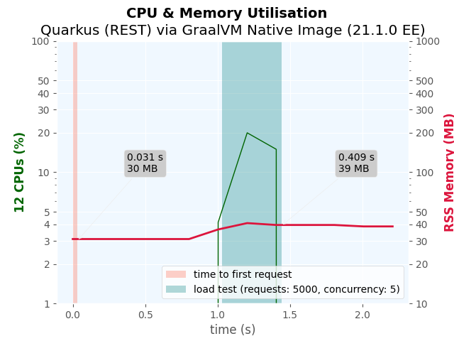 | 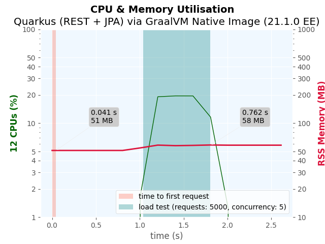 |

### **(3.2) Quarkus via Java Runtime**

| REST Only                                         | REST + CRUD                                         |
| ---------------------------------------------- | ------------------------------------------------ |
| 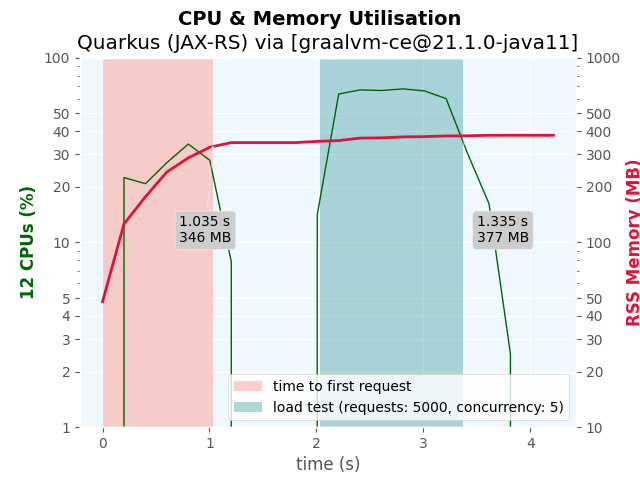 | 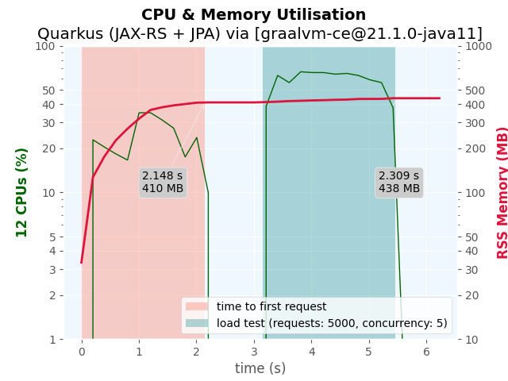 |
| 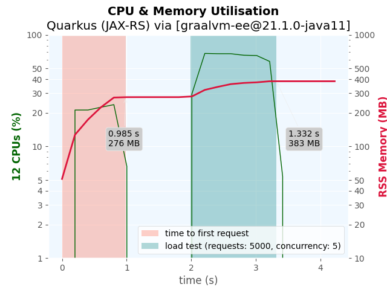 | 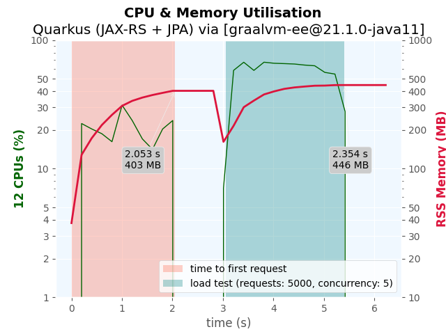 |

### **(3.3) Payara Micro via Java Runtime**

| REST Only                                         | REST + CRUD                                         |
| ---------------------------------------------- | ------------------------------------------------ |
| 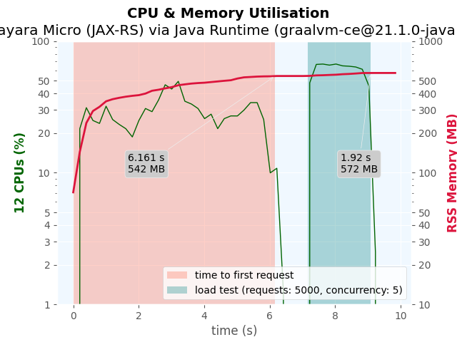 | 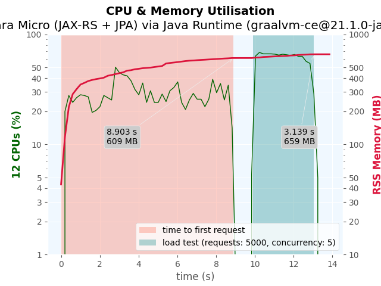 |
| 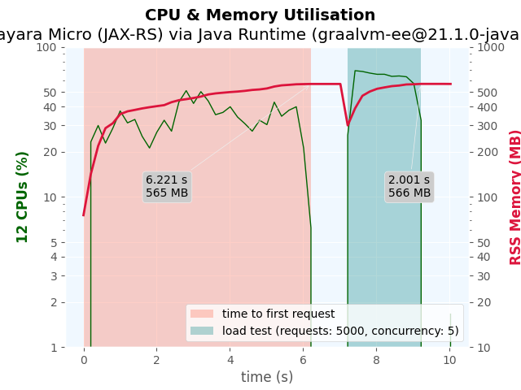 | 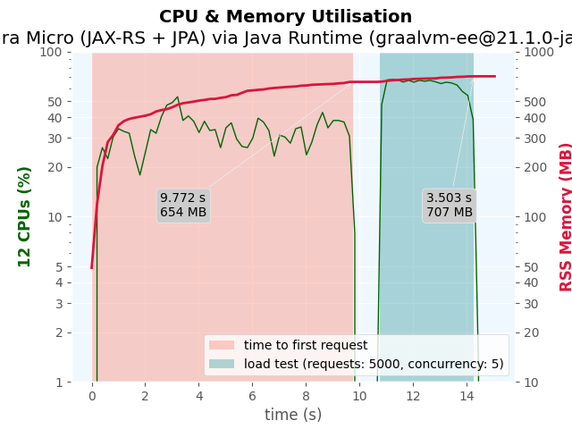 |

### **(3.4) Spring Boot via GraalVM Native Image**

| Simple                                        | Advanced                                        |
| --------------------------------------------- | ----------------------------------------------- |
| 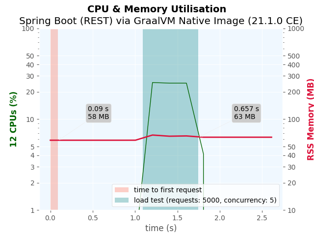 | 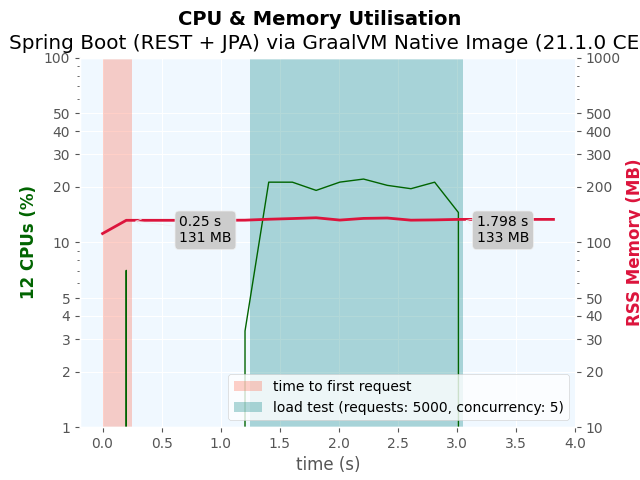 |

### **(3.5) Spring Boot via Java Runtime**

| REST Only                                        | REST + CRUD                                        |
| --------------------------------------------- | ----------------------------------------------- |
| 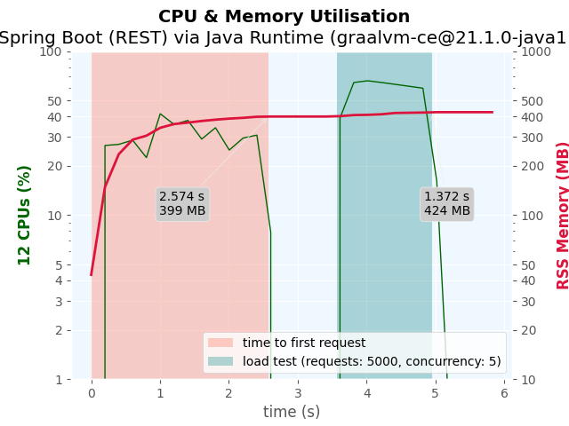 |  |
| 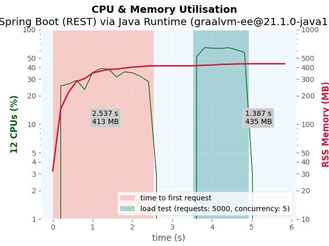 | 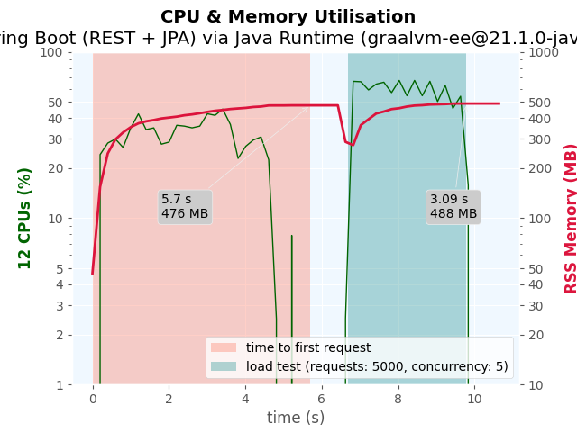 |

### **(3.6) Python**

| REST Only                       | REST + CRUD                       |
| ---------------------------- | ------------------------------ |
| 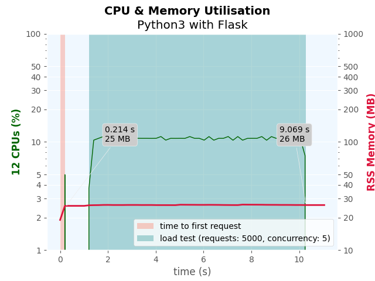 | 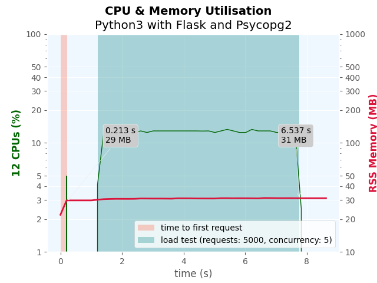 |

## **(4) Used Runtimes, Frameworks and Libraries**

* Quarkus - <https://quarkus.io>
* GraalVM - <https://www.graalvm.org>
* OpenJ9 - <https://www.eclipse.org/openj9>
* OpenJDK RI - <https://jdk.java.net/java-se-ri/8>
* Adopt OpenJDK - <https://adoptopenjdk.net/>
* Payara Micro - <https://www.payara.fish>
* Spring Boot - <https://spring.io/projects/spring-boot>
* psrecord - <https://github.com/astrofrog/psrecord>
* psutil - <https://psutil.readthedocs.io>
* matplotlib - <https://matplotlib.org>
* jabba - <https://github.com/shyiko/jabba>
* Apache Benchmarking Tool - <https://httpd.apache.org/docs/2.4/programs/ab.html>
